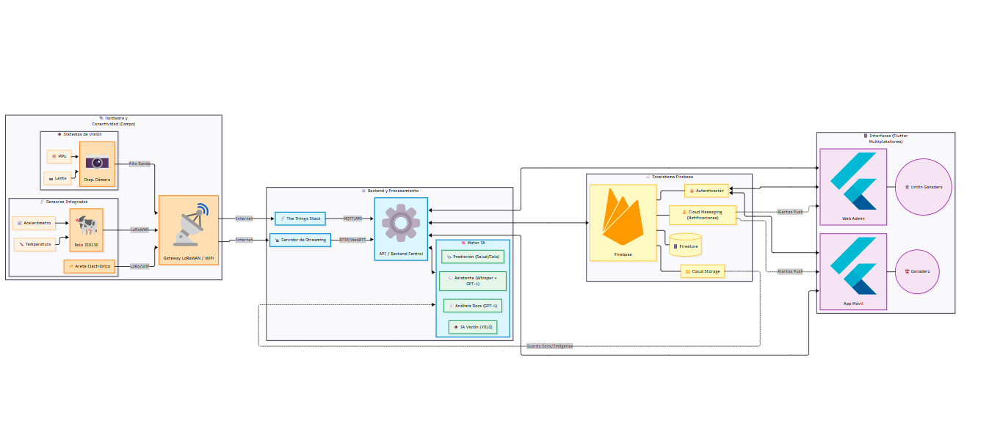

# Agro Control Pro - Gestión Agropecuaria Inteligente

Bienvenido al repositorio de **Agro Control Pro**, una plataforma integral y modular diseñada para la transformación digital del sector agropecuario, enfocada en la **trazabilidad de ganado** y la **agilización de trámites en la asociación ganadera**. Este monorepo integra aplicaciones móviles, servicios de Inteligencia Artificial y un backend robusto para optimizar la gestión de ganado, inventarios, procesos administrativos y monitoreo en tiempo real.

---

## 🚀 Estructura del Proyecto



El sistema está compuesto por tres módulos principales:

1.  **Mobile (`/mobile`)**: Aplicación **Flutter** de alto rendimiento para Android e iOS. Ofrece una experiencia de usuario premium con paneles de control, asistentes de voz y gestión documental.
2.  **Backend (`/backend`)**: Núcleo en **Node.js (Express)** que orquesta la lógica de negocio, integración con Firebase, servicios de IA de terceros y comunicación via WebSockets.
3.  **ApiDetection (`/ApiDetection`)**: Servicio especializado en visión artificial que utiliza modelos **YOLO/PyTorch** para la detección e identificación de ganado en imágenes y video.

---

## 🌟 Funcionalidades Clave

### 🤖 Cowy (Asistente Inteligente)
-   **Interacción Multimodal**: Soporta comandos de voz (STT via Groq/Whisper) y texto con respuestas en streaming (WebSockets).
-   **Contexto Operativo**: El asistente conoce automáticamente la UPP (Unidad de Producción Pecuaria) del usuario y puede consultar datos de inventario, ganado y finanzas en tiempo real.
-   **Preguntas Frecuentes**: Responde dudas comunes sobre los trámites ganaderos (requisitos, documentación, plazos).
-   **Consulta de Trámites Activos**: Permite al usuario consultar el estado y avance de sus trámites en curso directamente desde el chat.
-   **Adjuntar Documentos**: Los usuarios pueden subir documentos requeridos para sus trámites directamente desde la conversación.

### 👁️ Visión Artificial y Documentación
-   **Verificación de Documentos**: Análisis automático de legibilidad y autenticidad de documentos mediante **Azure OpenAI (GPT-4o Vision)**.
-   **Detección de Ganado**: Identifica cuántas vacas hay en una imagen y clasifica su postura (parada o echada) mediante el servicio `ApiDetection`.
    - **Prueba en vivo**: Puedes probar el modelo de detección desde nuestra interfaz en Azure: [Test API de Detección](https://detect.politepebble-de41f15a.westus.azurecontainerapps.io/test.html).
-   **Entrenamiento del Modelo** (`ApiDetection/TrainModel.ipynb`): Notebook de Google Colab utilizado para entrenar el modelo **YOLO11n**. Se usó el dataset **[MMCows (Kaggle)](https://www.kaggle.com/datasets/hienvuvg/mmcows)**. Entrenado durante 50 épocas sobre ~5,040 imágenes con 2 clases (`standing`, `lying`), alcanzando un **mAP50 de 99.4%** y **mAP50-95 de 90.6%**.

### 📱 Identidad Digital y Notificaciones
-   **Google Wallet**: Integración nativa para portar credenciales de productor, certificados de sanidad y documentos oficiales de manera digital.
-   **Sistema de Alertas**: Notificaciones push (FCM) categorizadas por importancia (`Crítico`, `Advertencia`, `Informativo`) con iconos dinámicos y estados de lectura.

### 📊 Gestión y Monitoreo
-   **Trámites Multi-etapa**: Flujos de trabajo guiados para Pruebas Ganaderas, Movilización y Exportación.
-   **Telemetría de Sensores**: Monitoreo en tiempo real de temperatura, ubicación GPS, acelerómetro y giroscopio para el bienestar animal.
-   **Dashboard de KPIs**: Panel visual optimizado para el seguimiento de compras, ventas y stock de suministros.

---

## 🛠️ Tecnologías Utilizadas

| Componente | Tecnologías |
| :--- | :--- |
| **Mobile** | Flutter (Dart), Firebase Messaging, Google Fonts (Outfit/Inter). |
| **Backend** | Node.js, Express, Firebase Admin SDK, WebSockets, Google Wallet API. |
| **IA & NLP** | Azure OpenAI (GPT-4o), Groq API (Whisper STT). |
| **Computer Vision** | Python, PyTorch (YOLO), Node.js (ApiDetection). |
| **Infraestructura** | Docker, Azure Container Apps, Firebase (Firestore, Storage, FCM). |

---

## ⚙️ Configuración y Despliegue

### 📋 Prerrequisitos
-   **Entorno**: Node.js v18+, Flutter SDK.
-   **Contenedores**: Docker y Docker Compose para despliegue local o en la nube.
-   **Credenciales**: Archivos `.env` y llaves de servicio de Firebase configuradas en cada módulo.

### 🏃 Ejecución Rápida (Entorno de Desarrollo)

#### 1. Backend & Servicios
```bash
# Iniciar API Principal
cd backend && npm install && npm start

# Iniciar Servicio de Detección
cd ApiDetection && npm install && node index.js
```

#### 2. Aplicación Móvil
```bash
cd mobile
flutter pub get
flutter run --flavor dev
```

### 🐳 Despliegue con Docker

El proyecto está completamente containerizado. Se incluyen Dockerfiles para cada servicio y dos archivos Docker Compose:

| Archivo | Propósito |
| :--- | :--- |
| `docker-compose.dev.yml` | Desarrollo local con hot-reload y montaje de volúmenes. |
| `docker-compose.prod.yml` | Producción — usa imágenes pre-construidas de Docker Hub. |

**Servicios containerizados:**

| Servicio | Imagen Docker Hub | Puerto |
| :--- | :--- | :--- |
| Backend (API Express) | `marito11/agro-backend:latest` | `3000` |
| ApiDetection (YOLO) | `marito11/agro-detection:latest` | `3002` |

```bash
# Desarrollo local (construye desde código fuente)
docker compose -f docker-compose.dev.yml up --build

# Producción (descarga imágenes de Docker Hub)
docker compose -f docker-compose.prod.yml up -d
```

> **Nota:** Requiere un archivo `.env.prod` con las variables de entorno (ver `.env.prod.example`) y los archivos de credenciales `firebase-service-account.json` y `google-wallet-credentials.json`.

### ☁️ Despliegue en Azure Container Apps

El sistema de producción está desplegado en **Azure Container Apps**, ofreciendo escalado automático, HTTPS nativo y alta disponibilidad:

```
┌─────────────────────────────────────────────┐
│         Azure Container Apps Environment    │
│                                             │
│  ┌───────────────────┐  ┌────────────────┐  │
│  │  agro-backend     │  │ agro-detection │  │
│  │  (Express API)    │  │ (YOLO/Python)  │  │
│  │  Puerto: 3000     │  │ Puerto: 3002   │  │
│  │  Ingress: externo │  │ Ingress: inter │  │
│  └────────┬──────────┘  └───────▲────────┘  │
│           │    comunicación     │            │
│           └─────────────────────┘            │
└─────────────────────────────────────────────┘
         ▲                    ▲
         │ HTTPS              │
    Mobile App          Firebase / Azure OpenAI
```

-   **Backend**: Ingress externo — accesible por la app móvil via HTTPS.
-   **ApiDetection**: Ingress interno — solo accesible por el backend dentro del mismo environment.
-   Las imágenes se despliegan directamente desde **Docker Hub** al environment de Azure.

---

## 🗄️ Resumen de Datos (Firebase Firestore)

Para un detalle exhaustivo, consulte [ESTRUCTURA_BD.md](file:///c:/Users/mario/OneDrive/Escritorio/cositas/programas/programas/proyectos/Galardon/Proyecto/Proyecto/ESTRUCTURA_BD.md).

-   **`usuarios`**: Perfiles, roles y tokens FCM.
-   **`ganado` / `monitoreo`**: Fichas técnicas y telemetría de sensores.
-   **`inventario`**: Control biológico y de insumos.
-   **`tramites`**: Expedientes digitales y historial de procesos.
-   **`compras_lotes` / `ventas_salidas`**: Registro financiero de transacciones.
-   **`sesiones`**: Contexto e historial de interacciones con Cowy.

---

## 🤝 Contribución

Para colaborar en el proyecto:
1. Lee las reglas específicas en [AGENTS.md](file:///c:/Users/mario/OneDrive/Escritorio/cositas/programas/programas/proyectos/Galardon/Proyecto/Proyecto/AGENTS.md).
2. Crea una rama para tu funcionalidad (`git checkout -b feature/nueva-mejora`).
3. Envía un Pull Request para revisión.

---
**Desarrollado con ❤️ para la modernización del campo.**

